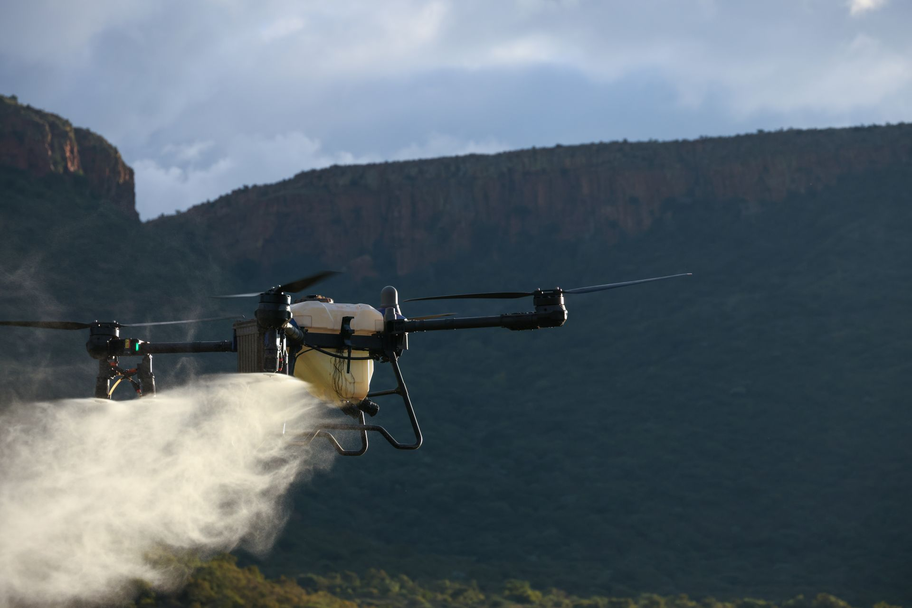

# AquaField · BY

Landing page for an agricultural drone irrigation service in Belarus.  
50 L tank, GPS routing, nationwide coverage — built with plain HTML, CSS, and JavaScript.

**[View live site →](https://pavelbuiko04.github.io/AquaField/)**



---

## About

A single-page website for **AquaField · BY** — aerial field irrigation when ground machinery cannot reach the crop.  
Warm agro aesthetic, responsive layout, smooth navigation, and a mobile menu.

**Key figures on the site:**
- 50 L — tank capacity per flight
- 45 BYN — price per hectare
- 80+ ha — output per workday

---

## Sections

| Block | Content |
|-------|---------|
| Hero | Drone background, offer, CTA buttons |
| Marquee | Scrolling benefit strip |
| Stats | Key metrics |
| Mission | Why aerial irrigation |
| Services | Three service types |
| Process | 4-step workflow |
| Drone | Equipment card and gallery |
| Advantages | Service benefits |
| Pricing | 45 BYN/ha rate |
| CTA + Footer | Contacts and navigation |

---

## Stack

- **HTML5** — semantic markup, inline [Lucide](https://lucide.dev) SVG sprite
- **CSS3** — custom properties, Grid/Flexbox, responsive 320–1200+ px
- **JavaScript** — menu, scroll, active links, image fallbacks
- **Fonts** — [Fraunces](https://fonts.google.com/specimen/Fraunces) + [Inter](https://fonts.google.com/specimen/Inter)

No bundlers, npm, or frameworks.

---

## Structure

```
dron/
├── index.html
├── css/
│   ├── styles.css      # layout, components, responsive
│   ├── character.css   # palette, typography, character
│   └── icons.css       # icon sizing
├── js/
│   └── main.js         # interactivity
└── assets/
    └── images/         # photos and SVG placeholders
```

---

## Run locally

```bash
python3 -m http.server 8765
```

Open in your browser: [http://localhost:8765](http://localhost:8765)

Or open `index.html` directly — some behavior may differ without an HTTP server.

---

## License

Demo landing page. Contact details and brand name are placeholders — replace them before production use.
